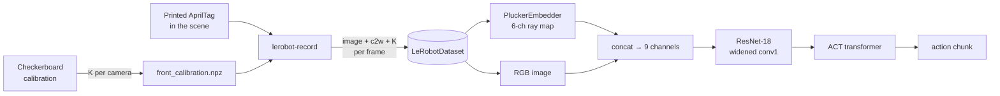

# LeRobot + Camera-Conditioned ACT (Plücker Rays)

> **Branch:** `act_plukcker` · fork of [huggingface/lerobot](https://github.com/huggingface/lerobot)

This branch makes the **ACT** policy *camera-aware*. Following the idea in
*"Do You Know Where Your Camera Is?"*, every camera image is paired with a
per-pixel **Plücker ray map** computed from that camera's intrinsics (`K`) and
extrinsics (camera-to-world pose). The policy then knows *where each pixel is
looking from* in 3D, which should make it more robust when a camera is moved
between episodes.

To get those camera poses, `lerobot-record` now detects a printed **AprilTag**
in the scene and stores each camera's pose and intrinsics alongside every
recorded frame.

The upstream LeRobot README is kept below, [after this section](#lerobot-upstream-readme).

---

## What's new on this branch

| Area | File(s) | Change |
|---|---|---|
| **ACT policy** | `src/lerobot/policies/act/configuration_act.py` | New `use_plucker: bool = False` flag (off by default, so plain ACT is unchanged). |
| | `src/lerobot/policies/act/modeling_act.py` | `PluckerEmbedder` module; ResNet `conv1` widened from 3 → **9 input channels** (RGB + 6 Plücker), extra channels zero-initialised so the pretrained weights behave as before at the start of training; live AprilTag fallback at inference. |
| **Recording** | `src/lerobot/scripts/lerobot_record.py` | Adds `observation.extrinsics.<cam>` (4×4) and `observation.intrinsics.<cam>` (3×3) for every camera in `--robot.cameras`. Detects the tag pose once per episode, then reuses it. Episodes with no frames are retried instead of crashing. |
| **Pose estimation** | `src/lerobot/utils/apriltag_pose.py` | Shared AprilTag (36h11) detection + `solvePnP` (IPPE_SQUARE) → camera-to-world matrix. Recording and inference both use this module, so they compute poses the same way. |
| **Calibration** | `src/lerobot/cameras/opencv/camera_calibration.py` | Checkerboard intrinsics calibration with outlier-frame rejection, annotated debug images, and headless (terminal) capture mode. Writes `<cam>_calibration.npz`. |
| **Tools** | `src/lerobot/cameras/opencv/generate_april_tag.py` | Generates a printable AprilTag. |
| | `src/lerobot/scripts/test_april_tag.py` | Live check: is the tag detected, and how far away is it? |
| | `src/lerobot/scripts/validate_april_tag.py` | Re-projects the tag + XYZ axes onto a recorded dataset using the saved extrinsics/intrinsics to verify them. |

---

## How it works



**Plücker embedding.** For each pixel `(u, v)`, the ray direction is
`d = R · K⁻¹ [u+0.5, v+0.5, 1]ᵀ` (normalised) and the ray origin is the camera
centre `o`. The 6-channel embedding is `[o × d, d]`. It is concatenated to the
RGB image before the vision backbone.

**Static camera per episode.** The camera is assumed to stay still during an
episode and only move between episodes. During recording, the tag is detected on
each frame until it is first found, and that pose is reused for the rest of the
episode. This saves about 20 ms per camera per frame.

---

## Workflow

### 0. Install

```bash
uv sync --locked --extra all
```

> `lerobot` installs `opencv-python-headless`, so OpenCV has no GUI windows.
> All tools here work without a GUI: they fall back to terminal prompts and
> save debug images to disk. If you want live windows, swap in `opencv-python`.

### 1. Print an AprilTag

```bash
uv run python src/lerobot/cameras/opencv/generate_april_tag.py   # → apriltag_small.png (tag36h11, id 0)
```

Print it, place it flat in view of every camera, and **measure the black square
with a ruler**. Set `TAG_SIZE_M` in `src/lerobot/utils/apriltag_pose.py` to that
value (currently `0.052` m).

### 2. Calibrate each camera's intrinsics

Run once for **each** camera, using the same name you will give it in `--robot.cameras`:

```bash
uv run python -m lerobot.cameras.opencv.camera_calibration \
    --camera-name front \
    --camera-index 0 \
    --square-size-m 0.025
```

- Captures ~15 checkerboard shots (9×6 inner corners by default), saving them to `calib_images/front/`.
- Writes `front_calibration.npz` to the current directory. `lerobot-record` loads it automatically.
- Aim for RMS reprojection error **< 0.5 px** (< 1.0 is usable). Frames with error above 1 px are dropped and the camera is recalibrated once without them.
- Re-run on existing images with `--skip-capture`.

> ⚠️ If a camera has no calibration file, a placeholder `K` is used and a
> warning is logged. Extrinsics for that camera will be **wrong**.

### 3. Sanity-check tag detection

```bash
uv run python src/lerobot/scripts/test_april_tag.py \
    --camera-index 0 --camera-name front --tag-size 0.052
```

Compare the reported distance against a ruler.

### 4. Record a dataset (with extrinsics)

Run `lerobot-record` from the directory that contains `<cam>_calibration.npz`:

```bash
lerobot-record \
    --robot.type=so101_follower \
    --robot.port=/dev/ttyACM0 \
    --robot.id=my_follower \
    --robot.cameras="{front: {type: opencv, index_or_path: 0, width: 640, height: 480, fps: 30}}" \
    --teleop.type=so101_leader \
    --teleop.port=/dev/ttyACM1 \
    --teleop.id=my_leader \
    --dataset.repo_id=${HF_USER}/camera_condition_v1 \
    --dataset.num_episodes=50 \
    --dataset.single_task="Pick up the cube" \
    --dataset.streaming_encoding=true \
    --dataset.encoder_threads=2
```

Each frame then also contains:

| Key | Shape | Meaning |
|---|---|---|
| `observation.extrinsics.front` | `(4, 4)` | camera-to-world (tag frame) pose; identity if the tag was never seen |
| `observation.intrinsics.front` | `(3, 3)` | calibrated `K` |

Move the camera **between** episodes (not during) to get viewpoint diversity.

### 5. Validate the recorded poses

```bash
uv run python src/lerobot/scripts/validate_april_tag.py \
    --repo-id ${HF_USER}/camera_condition_v1 \
    --camera-name front
```

This draws the tag outline and XYZ axes back onto the frames, using the saved
poses. If the overlays line up with the physical tag, the extrinsics are
correct. In headless mode it saves frames to `validate_april_tag_debug/`.

### 6. Train camera-conditioned ACT

```bash
lerobot-train \
    --dataset.repo_id=${HF_USER}/camera_condition_v1 \
    --policy.type=act \
    --policy.use_plucker=true \
    --policy.repo_id=${HF_USER}/act_camera_conditioned \
    --output_dir=outputs/train/act_camera_condition_v1 \
    --batch_size=8 \
    --steps=100000
```

Without `--policy.use_plucker=true`, this trains standard ACT. That gives you a
baseline on the same dataset to compare against.

### 7. Run on the robot

```bash
lerobot-rollout \
    --strategy.type=base \
    --policy.path=${HF_USER}/act_camera_conditioned \
    --robot.type=so101_follower \
    --robot.port=/dev/ttyACM0 \
    --robot.cameras="{front: {type: opencv, index_or_path: 0, width: 640, height: 480, fps: 30}}" \
    --task="Pick up the cube" --duration=60
```

Live robot observations don't include extrinsics or intrinsics. When they are
missing, ACT computes them from the current frame using `apriltag_pose` (with
batch size 1). **Keep the AprilTag visible during rollout** and run from the
directory that contains the calibration files.

---

## Known limitations / TODO

- Only one AprilTag (the first one detected) defines the world frame, and lens distortion is ignored in `solvePnP`.
- If the tag is never detected in an episode, that episode is saved with an **identity** pose and no error is raised. Check with `validate_april_tag.py`.
- At inference, the pose is re-estimated on every step instead of once per episode.
- `<cam>_calibration.npz` is loaded from the current working directory.
- `generate_april_tag.py` calls `cv2.imshow`, which fails with headless OpenCV after the PNG has already been saved.
- Calibration images, debug frames and a trained checkpoint (`src/ouputs/`, ~200 MB) are currently committed. They should probably be moved to the Hub or `.gitignore`d.

## Reference

- *Do You Know Where Your Camera Is? View-Invariant Policy Learning with Camera Conditioning*. Plücker-ray camera conditioning for visuomotor policies.
- *Learning Fine-Grained Bimanual Manipulation with Low-Cost Hardware* (ACT). Zhao et al., 2023.

---

<a id="lerobot-upstream-readme"></a>

<p align="center">
  
</p>

<div align="center">

[](https://github.com/huggingface/lerobot/actions/workflows/latest_deps_tests.yml?query=branch%3Amain)
[](https://github.com/huggingface/lerobot/actions/workflows/docker_publish.yml?query=branch%3Amain)
[](https://www.python.org/downloads/)
[](https://github.com/huggingface/lerobot/blob/main/LICENSE)
[](https://pypi.org/project/lerobot/)
[](https://pypi.org/project/lerobot/)
[](https://github.com/huggingface/lerobot/blob/main/CODE_OF_CONDUCT.md)
[](https://discord.gg/q8Dzzpym3f)

</div>

**LeRobot** aims to provide models, datasets, and tools for real-world robotics in PyTorch. The goal is to lower the barrier to entry so that everyone can contribute to and benefit from shared datasets and pretrained models.

🤗 A hardware-agnostic, Python-native interface that standardizes control across diverse platforms, from low-cost arms (SO-100) to humanoids.

🤗 A standardized, scalable LeRobotDataset format (Parquet + MP4 or images) hosted on the Hugging Face Hub, enabling efficient storage, streaming and visualization of massive robotic datasets.

🤗 State-of-the-art policies that have been shown to transfer to the real-world ready for training and deployment.

🤗 Comprehensive support for the open-source ecosystem to democratize physical AI.

## Quick Start

LeRobot can be installed directly from PyPI.

```bash
pip install lerobot
lerobot-info
```

> [!IMPORTANT]
> For detailed installation guide, please see the [Installation Documentation](https://huggingface.co/docs/lerobot/installation).

## Robots & Control

<div align="center">
  
</div>

LeRobot provides a unified `Robot` class interface that decouples control logic from hardware specifics. It supports a wide range of robots and teleoperation devices.

```python
from lerobot.robots.myrobot import MyRobot

# Connect to a robot
robot = MyRobot(config=...)
robot.connect()

# Read observation and send action
obs = robot.get_observation()
action = model.select_action(obs)
robot.send_action(action)
```

**Supported Hardware:** SO100, LeKiwi, Koch, HopeJR, OMX, EarthRover, Reachy2, Gamepads, Keyboards, Phones, OpenARM, Unitree G1, reBot B601.

While these devices are natively integrated into the LeRobot codebase, the library is designed to be extensible. You can easily implement the Robot interface to utilize LeRobot's data collection, training, and visualization tools for your own custom robot.

For detailed hardware setup guides, see the [Hardware Documentation](https://huggingface.co/docs/lerobot/integrate_hardware).

## LeRobot Dataset

To solve the data fragmentation problem in robotics, we utilize the **LeRobotDataset** format.

- **Structure:** Synchronized MP4 videos (or images) for vision and Parquet files for state/action data.
- **HF Hub Integration:** Explore thousands of robotics datasets on the [Hugging Face Hub](https://huggingface.co/lerobot).
- **Tools:** Seamlessly delete episodes, split by indices/fractions, add/remove features, and merge multiple datasets.

```python
from lerobot.datasets.lerobot_dataset import LeRobotDataset

# Load a dataset from the Hub
dataset = LeRobotDataset("lerobot/aloha_mobile_cabinet")

# Access data (automatically handles video decoding)
episode_index=0
print(f"{dataset[episode_index]['action'].shape=}\n")
```

Learn more about it in the [LeRobotDataset Documentation](https://huggingface.co/docs/lerobot/lerobot-dataset-v3)

## SoTA Models

LeRobot implements state-of-the-art policies in pure PyTorch, covering Imitation Learning, Reinforcement Learning, Vision-Language-Action (VLA) models, World Models, and Reward Models, with more coming soon. It also provides you with the tools to instrument and inspect your training process.

<p align="center">
  
</p>

Training a policy is as simple as running a script configuration:

```bash
lerobot-train \
  --policy.type=act \
  --dataset.repo_id=lerobot/aloha_mobile_cabinet
```

| Category                   | Models                                                                                                                                                                                                                                                                                                                                                                                     |
| -------------------------- | ------------------------------------------------------------------------------------------------------------------------------------------------------------------------------------------------------------------------------------------------------------------------------------------------------------------------------------------------------------------------------------------ |
| **Imitation Learning**     | [ACT](./docs/source/policy_act_README.md), [Diffusion](./docs/source/policy_diffusion_README.md), [VQ-BeT](./docs/source/policy_vqbet_README.md), [Multitask DiT Policy](./docs/source/policy_multi_task_dit_README.md)                                                                                                                                                                    |
| **Reinforcement Learning** | [HIL-SERL](./docs/source/hilserl.mdx), [TDMPC](./docs/source/policy_tdmpc_README.md) & QC-FQL (coming soon)                                                                                                                                                                                                                                                                                |
| **VLAs Models**            | [Pi0](./docs/source/pi0.mdx), [Pi0Fast](./docs/source/pi0fast.mdx), [Pi0.5](./docs/source/pi05.mdx), [GR00T N1.7](./docs/source/policy_groot_README.md), [SmolVLA](./docs/source/policy_smolvla_README.md), [XVLA](./docs/source/xvla.mdx), [EO-1](./docs/source/eo1.mdx), [MolmoAct2](./docs/source/molmoact2.mdx), [WALL-OSS](./docs/source/walloss.mdx), [EVO1](./docs/source/evo1.mdx) |
| **World Models**           | [VLA-JEPA](./docs/source/vla_jepa.mdx), [LingBot-VA](./docs/source/lingbot_va.mdx), [FastWAM](./docs/source/fastwam.mdx)                                                                                                                                                                                                                                                                   |
| **Reward Models**          | [SARM](./docs/source/sarm.mdx), [TOPReward](./docs/source/topreward.mdx), [Robometer](./docs/source/robometer.mdx)                                                                                                                                                                                                                                                                         |

Similarly to the hardware, you can easily implement your own policy & leverage LeRobot's data collection, training, and visualization tools, and share your model to the HF Hub

For detailed policy setup guides, see the [Policy Documentation](https://huggingface.co/docs/lerobot/bring_your_own_policies). For GPU/RAM requirements and expected training time per policy, see the [Compute Hardware Guide](https://huggingface.co/docs/lerobot/hardware_guide).

## Inference & Evaluation

Evaluate your policies in simulation or on real hardware using the unified evaluation script. LeRobot supports standard benchmarks like **LIBERO**, **MetaWorld** and more to come.

```bash
# Evaluate a policy on the LIBERO benchmark
lerobot-eval \
  --policy.path=lerobot/pi0_libero_finetuned \
  --env.type=libero \
  --env.task=libero_object \
  --eval.n_episodes=10
```

Learn how to implement your own simulation environment or benchmark and distribute it from the HF Hub by following the [EnvHub Documentation](https://huggingface.co/docs/lerobot/envhub)

## Resources

- **[Documentation](https://huggingface.co/docs/lerobot/index):** The complete guide to tutorials & API.
- **[Chinese Tutorials: LeRobot+SO-ARM101中文教程-同济子豪兄](https://zihao-ai.feishu.cn/wiki/space/7589642043471924447)** Detailed doc for assembling, teleoperate, dataset, train, deploy. Verified by Seed Studio and 5 global hackathon players.
- **[Discord](https://discord.gg/q8Dzzpym3f):** Join the `LeRobot` server to discuss with the community.
- **[X](https://x.com/LeRobotHF):** Follow us on X to stay up-to-date with the latest developments.
- **[Robot Learning Tutorial](https://huggingface.co/spaces/lerobot/robot-learning-tutorial):** A free, hands-on course to learn robot learning using LeRobot.
- **[T-Shirt Folding Experiment](https://huggingface.co/spaces/lerobot/robot-folding):** An end-to-end demonstration of folding t-shirts with LeRobot.
- **[LeLab](https://github.com/huggingface/leLab):** A web interface for LeRobot — teleoperate, calibrate, record datasets, replay, and train your SO arm from the browser, no CLI required.

## Citation

If you use LeRobot in your project, please cite the GitHub repository to acknowledge the ongoing development and contributors:

```bibtex
@misc{cadene2024lerobot,
    author = {Cadene, Remi and Alibert, Simon and Soare, Alexander and Gallouedec, Quentin and Zouitine, Adil and Palma, Steven and Kooijmans, Pepijn and Aractingi, Michel and Shukor, Mustafa and Aubakirova, Dana and Russi, Martino and Capuano, Francesco and Pascal, Caroline and Choghari, Jade and Meftah, Khalil and Ellerbach, Maxime and Moss, Jess and Wolf, Thomas},
    title = {LeRobot: State-of-the-art Machine Learning for Real-World Robotics in Pytorch},
    howpublished = "\url{https://github.com/huggingface/lerobot}",
    year = {2024}
}
```

If you are referencing our research or the academic paper, please also cite our ICLR publication:

<details>
<summary><b>ICLR 2026 Paper</b></summary>

```bibtex
@inproceedings{cadenelerobot,
  title={LeRobot: An Open-Source Library for End-to-End Robot Learning},
  author={Cadene, Remi and Alibert, Simon and Capuano, Francesco and Aractingi, Michel and Zouitine, Adil and Kooijmans, Pepijn and Choghari, Jade and Russi, Martino and Pascal, Caroline and Palma, Steven and Shukor, Mustafa and Moss, Jess and Soare, Alexander and Aubakirova, Dana and Lhoest, Quentin and Gallou\'edec, Quentin and Wolf, Thomas},
  booktitle={The Fourteenth International Conference on Learning Representations},
  year={2026},
  url={https://arxiv.org/abs/2602.22818}
}
```

</details>

## Contribute

We welcome contributions from everyone in the community! To get started, please read our [CONTRIBUTING.md](https://github.com/huggingface/lerobot/blob/main/CONTRIBUTING.md) guide. Whether you're adding a new feature, improving documentation, or fixing a bug, your help and feedback are invaluable. We're incredibly excited about the future of open-source robotics and can't wait to work with you on what's next—thank you for your support!

<p align="center">
  
</p>

<div align="center">
<sub>Built by the <a href="https://huggingface.co/lerobot">LeRobot</a> team at <a href="https://huggingface.co">Hugging Face</a> with ❤️</sub>
</div>
